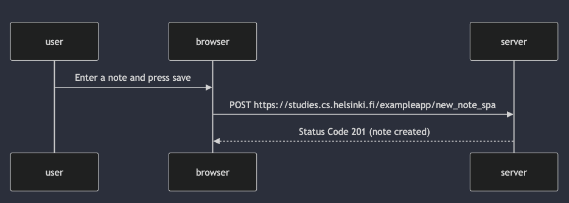

sequenceDiagram
participant user
participant browser
participant server

    user->>browser: Enter a note and press save
    browser->>server: POST https://studies.cs.helsinki.fi/exampleapp/new_note_spa
    server-->>browser: Status Code 201 (note created)

